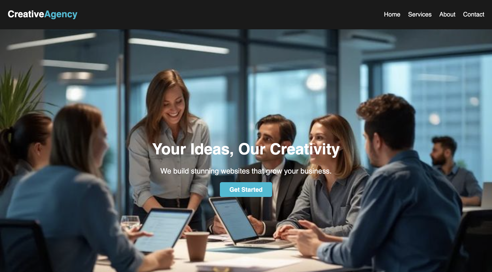
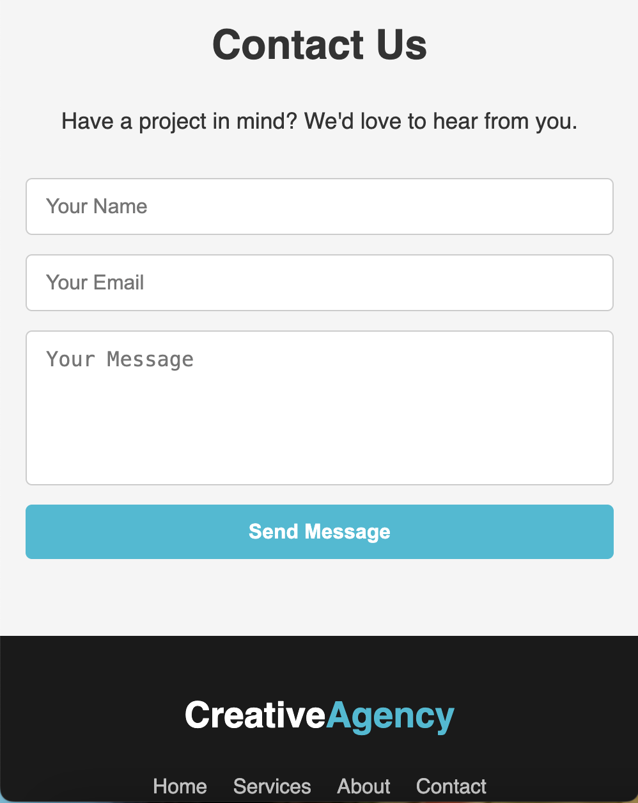

# 🌟 Creative Agency Website

A modern, responsive landing page for a creative agency — built using **HTML5** and **CSS3**.  
Showcasing services, about section, and contact form with beautiful layout and responsive design.


## 📸 Screenshots

### 🖥️ Desktop View



### 📱 Mobile View



>  Clean navigation, attractive hero section, modern services cards, and smooth contact form UI.

---

##  Features

-  Responsive Design (Desktop & Mobile)
-  Hero Section with CTA
-  Services Showcase
-  About Section
-  Contact Form
-  Social Media Icons
-  Font Awesome Icons
-  Smooth Hover Effects

---

##  Tech Stack

- **HTML5**
- **CSS3**
- **Font Awesome (CDN)**

---

## ⚙️ Setup Instructions

1. Clone the repository:
   ```bash
   git clone https://github.com/your-username/creative-agency.git
